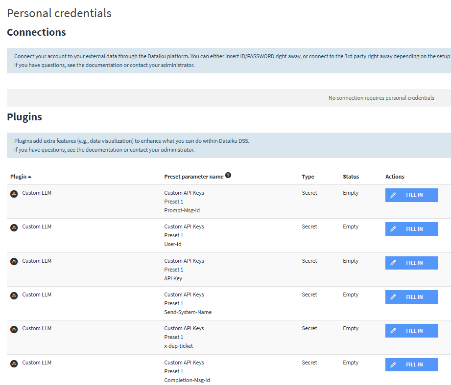

# Custom LLM - Dataiku Plugin

이 플러그인은 Dataiku에서 외부 LLM API(예: Custom LLM)를 쉽게 연결하여 사용할 수 있도록 지원합니다.

## 주요 기능
- Dataiku LLM Mesh 및 Prompt Studio에서 Custom LLM API 연동
- Chat Completion, Embedding 등 다양한 LLM 엔드포인트 지원
- 사용자별 Credential을 통한 Custom Header 관리
- Authorization, Send-System-Name, User-Id, Prompt-Msg-Id, Completion-Msg-Id, x-dep-ticket 헤더 지원

## 지원 환경 및 제한 사항
- Dataiku DSS 13.x 이상 필요
- 외부 LLM API(예: Custom LLM) 사용 권한 및 토큰 필요
- API 엔드포인트, 모델명 등은 직접 입력해야 함
- Java 기반 LLM Connector Plugin

## 설치 및 설정 방법
1. 플러그인 설치: [Dataiku 플러그인 설치 가이드](https://doc.dataiku.com/dss/latest/plugins/installing.html) 참고
2. Dataiku에서 플러그인 설정:
    - **Keys preset**: API 인증 및 Custom Header 정보를 포함한 Credential 설정
    - **Endpoint URL**: LLM API의 엔드포인트 URL 입력 (예: https://api.example.com/v1/chat/completions)
    - **Model Key**: 사용할 모델명 입력 (예: gpt-3.5, solar-pro 등)
    - **Input Type**: (임베딩 모델용) query 또는 passage
    - **Maximum Parallelism**: 최대 병렬 처리 수 (기본값: 8)
    - **Network Timeout**: 네트워크 타임아웃 (기본값: 60000ms)
    - **Max Retries**: 최대 재시도 횟수 (기본값: 3)
    - **First Retry Delay**: 첫 번째 재시도 지연시간 (기본값: 3000ms)
    - **Retry Delay Scale Factor**: 재시도 지연시간 배율 (기본값: 2)

### Credential 파라미터 (Keys preset)
| 파라미터명                | 설명                                    | 예시값                        |
|--------------------------|----------------------------------------|-------------------------------|
| api_key                  | API 인증 토큰 (Authorization 헤더)      | Bearer sk-xxxx...             |
| send_system_name_value   | Send-System-Name 헤더 값               | my-system-name                |
| user_id_value            | User-Id 헤더 값                        | user-123                      |
| prompt_msg_id_value      | Prompt-Msg-Id 헤더 값 (16자리 UUID)    | 12345678-1234-1234-1234-123456789abc |
| completion_msg_id_value  | Completion-Msg-Id 헤더 값 (16자리 UUID) | 87654321-4321-4321-4321-cba987654321 |
| x_dep_ticket_value       | x-dep-ticket 헤더 값                   | ticket-123                    |

### 연결 파라미터
| 파라미터명         | 설명                                 | 예시값                        |
|-------------------|--------------------------------------|-------------------------------|
| endpoint_url      | LLM API 엔드포인트                   | https://api.example.com/v1/chat/completions |
| model             | 모델명                               | gpt-3.5, solar-pro            |
| inputType         | (임베딩용) query/passage             | query                         |
| maxParallelism    | 최대 병렬 처리 수                    | 8                             |
| networkTimeout    | 네트워크 타임아웃 (ms)               | 60000                         |
| maxRetries        | 최대 재시도 횟수                     | 3                             |
| firstRetryDelay   | 첫 번째 재시도 지연시간 (ms)         | 3000                          |
| retryDelayScale   | 재시도 지연시간 배율                  | 2                             |

## 프로젝트 구조
```
custom-llm/
├── java-llms/customLLM/           # Java LLM Connector 소스코드
│   ├── jllm.json                  # LLM Connector 설정
│   └── src/com/customllm/llm/
│       └── CustomPlugin.java      # 메인 플러그인 클래스
├── parameter-sets/api-credentials/ # Credential 파라미터 정의
│   └── parameter-set.json         # API 키 및 Custom Header 설정
├── plugin.json                    # 플러그인 메타데이터
├── build.xml                      # 빌드 설정
└── assets/                        # 스크린샷 및 이미지
```

## 보안 및 주의사항
- API Key 및 Custom Header 값들은 Dataiku Credential 시스템을 통해 안전하게 관리됩니다.
- 사용자별 Credential 설정을 통해 개인정보/보안정보를 안전하게 관리하세요.
- 플러그인 소스코드 및 설정은 git 등 버전관리 시스템에 안전하게 관리하세요.
- UUID 형식의 Msg-Id 값들은 16자리 형식을 준수해야 합니다.

## 예시 스크린샷
(아래 이미지는 실제 환경에 맞게 교체/추가하세요)





## 변경 이력
- Custom LLM 일반화
- 사용자 Credential을 통한 Custom Header 관리 방식 구현
- Authorization, Send-System-Name, User-Id, Prompt-Msg-Id, Completion-Msg-Id, x-dep-ticket 헤더 지원
- 문서 및 파라미터 설명 최신화 